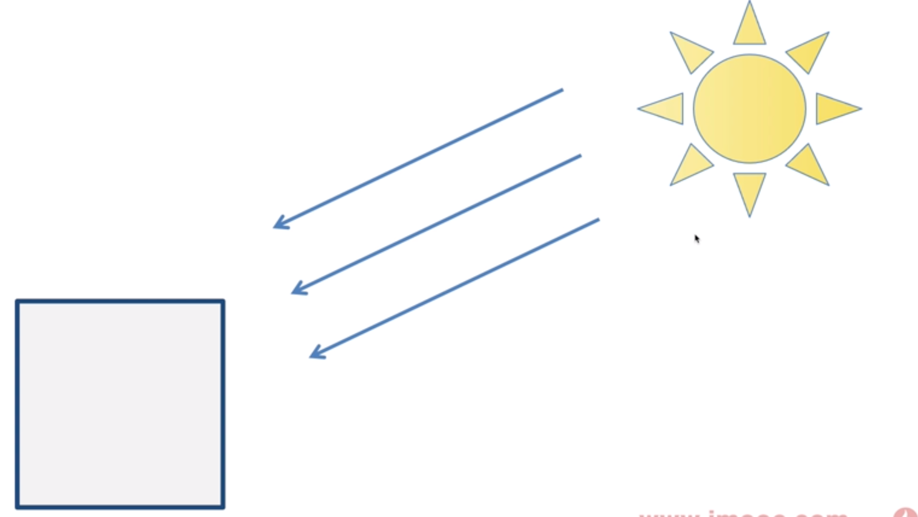
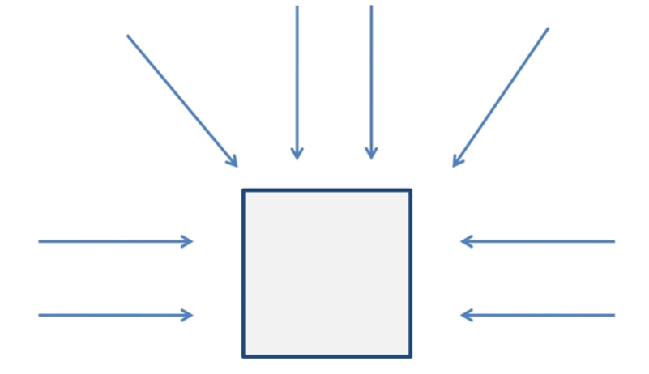
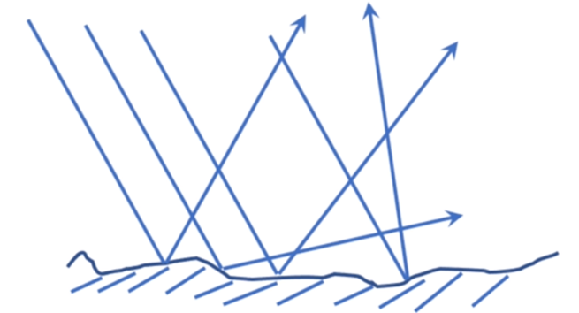

# 光源
## 点光源
简介：一个点项周围发出的光，如灯泡、火焰等, 是发散性的光

1. 根据照射的位置不同，光线方向也不同
2. 定义一个点光源需要的 `光源的位置，光线方向 及 颜色`

## 平行光

简介：可以看成是无限远处的光源发出的光，如太阳光，是平行光
1. 因为离光源的位置特别远，所以到达被照物体时可以认为光线是平行的。
2. 只需要 `光照方向 和 光照颜色`

## 环境光

简介：也就是间接光，是指光源发出后，经过其他物体各种发射， 然后照到物体表面上的光线。

* `环境反射`：环境反射是针对环境光而言的，在环境反射中，环境光照射物体是各方面均匀、强度相等的，反射的方向就是入射光的反方向。
* `环境反射`最终物体的颜色只跟`入射光颜色和基底色`有关
* `<环境反射光颜色> = <入射光颜色> * <表面基底色>`,因为物体表面是均匀的，所以反射出去也是均匀的
* 入射角度和反射角度相同

1. 环境光的强度差距非常小，没有必要精确计算光线强度。
2. 环境光是均匀照射到物体表面的，只需要定义`光照颜色`

## 漫反射
简介：现实中大多物体是粗糙的，所以入射角度和反射角度不同

1. 漫反射中反射光的颜色除了取决于`入射光的颜色、表面的基底色，还有入射光与物体表面的法向量形成的入射角`。
2. 令入射角为 a，漫反射光的颜色可以根据下式计算： `<漫反射光颜色> = <入射光颜色> * <表面基底色> * cos*a`
3. 入射角可以通过光线方向和法线方向的点积来计算：`<光线方向> · <法线方向>=cos*a`
4. 最终公式：`<漫反射光颜色> = <入射光颜色> * <表面基底色> * (<光线方向> · <法线方向>)`
5. “光线方向”指的是入射方向的反方向，即从入射点指向光源方向。
   
6. 当漫反射和环境反射同时存在时，将两者加起来，就会得到物体最终被 观察到的颜色：
   `<表面的反射光颜色> = <漫反射光颜色> + <环境反射光颜色>`
